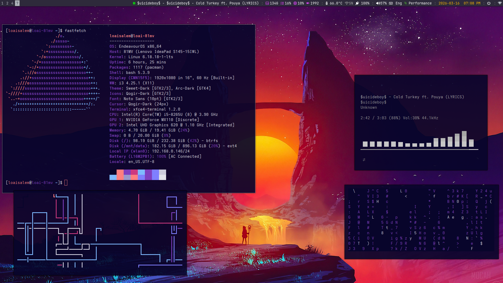
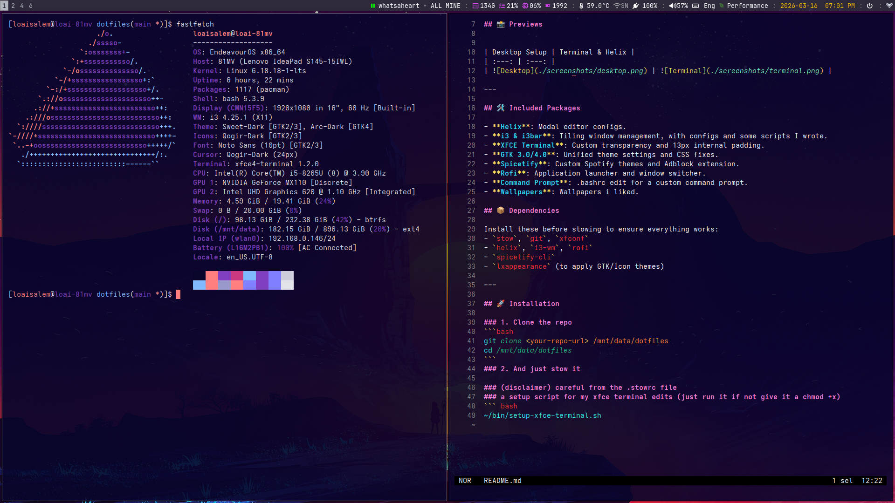

# 🐧 Loai's Dotfiles

Personal environment configurations managed with **GNU Stow**. 
This setup is focused on a clean, purple/dark aesthetic with a focus on efficiency.

| :---: | :---: |
|  |  |

---

## 🛠️ Included Packages

- **Helix**: Modal editor configs.
- **i3 & i3bar**: Tiling window management, with configs and some scripts I wrote.
- **XFCE Terminal**: Custom transparency and 13px internal padding.
- **GTK 3.0/4.0**: Unified theme settings and CSS fixes.
- **Spicetify**: Custom Spotify themes and Adblock extension.
- **Rofi**: Application launcher and window switcher.
- **Command Prompt**: .bashrc edit for a custom command prompt.
- **Wallpapers**: Wallpapers i liked.

## 📦 Dependencies

Install these before stowing to ensure everything works:
- `stow`, `git`, `xfconf`
- `helix`, `i3-wm`, `rofi`
- `spicetify-cli`
- `lxappearance` (to apply GTK/Icon themes)

---

## 🚀 Installation

### 1. Clone the repo
```bash
git clone <your-repo-url> /mnt/data/dotfiles
cd /mnt/data/dotfiles
```
### 2. And just stow it

### (disclaimer) careful from the .stowrc file
### a setup script for my xfce terminal edits (just run it if not give it a chmod +x)
``` bash
~/bin/setup-xfce-terminal.sh
